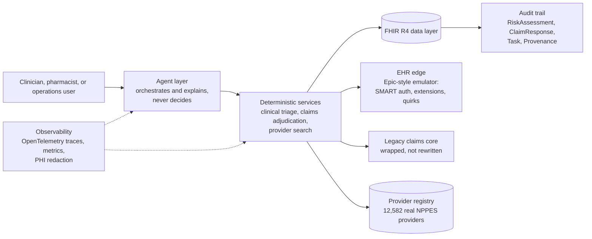

# Bhaskar Srinivasan

**Healthcare software engineering leader. I bring fragmented clinical data and legacy or acquired platforms together into reliable, standards-based products, and I build the engineering organizations that run them.**

15+ years leading software engineering, architecture, SRE, quality engineering, and data teams of 20 to 60 people, including managers, tech leads, and offshore partners. I currently lead engineering for an in-house EHR and clinical workflow orchestration platform in value-based primary care. MS in Electrical Engineering (USC). MBA (Carnegie Mellon Tepper).

[LinkedIn](https://www.linkedin.com/in/Bhaskar-Srinivasan) · [Email](mailto:bsrinivasan2023@gmail.com) · [Flagship repo: fhir-agent](https://github.com/bhaskarcmu/fhir-agent)

### What I bring to a healthcare data and interoperability platform

- **Interoperability:** integrated Epic, Athena, and Greenway over FHIR and HL7, covering 120+ clinical data endpoints. Built a standards-first FHIR R4 platform with full data lineage.
- **Unifying platforms:** moved a legacy monolith to an event-driven serverless architecture while delivery continued. I bring legacy and acquired systems onto shared contracts incrementally, without breaking the customers who rely on them.
- **Reliability at scale:** scaled a cloud platform 100x and cut latency from 10 seconds to under 1. Cut recovery times by more than 50% with SLOs, automated incident triage, and runbooks.
- **DevSecOps and quality, built in from the start:** CI/CD, security scanning, observability, and test strategy are designed in, not added before release.
- **Leading leaders:** grew an engineering org from 3 to 25. Led 45+ engineers on a $20M portfolio. Took over the scope of two departed senior leaders across seven disciplines with no added headcount.
- **AI with accountability:** agentic AI where models orchestrate and explain, deterministic rules decide, and every decision is auditable.

---

## Why a senior leader still builds

I lead through people and standards, not through my own code. I don't write my teams' production code. I still build, deliberately, because it keeps my judgment honest.

**Autonomy within shared standards.** Teams own how they deliver. Everyone shares a small set of non-negotiable standards: security, privacy and PHI handling, observability, and traceability for fast root-cause analysis. Contracts come first: we agree on APIs and on what core concepts like member, patient, provider, and encounter mean in each system before we integrate. This matters most when platforms come from different companies and eras.

**Close enough to ask good questions, far enough to let teams own decisions.** I stay technically engaged without taking over. Teams make the calls. I make sure the hard questions get asked early.

**Governance that surfaces problems early, and leadership that helps solve them.** Clear signals such as SLOs, delivery metrics, and risk reviews show when work is drifting. Anyone can escalate to me, and escalating is treated as responsible, not as failure. When I step in, I remove blockers, bring in resources, and advocate for the team. That is how I kept platforms stable through two senior leadership departures.

**Quality and reliability start at the design stage.** SRE and quality engineering belong at the design table, not at the end of the release.

**I build to keep standards practical.** I keep building working systems that span cloud architecture, data engineering, SRE, quality engineering, machine learning, and agentic AI. Building lets me show teams the simple, standard way through a complex problem, from experience rather than theory. The project below is one public example.

---

## Career highlights

**Oak Street Health, now part of CVS Health** (2023 to present)
*Director of Software Development, officially Senior Engineering Manager (2025 to present). Engineering Manager (2023 to 2024).*
- Lead 30+ engineers across development, quality engineering, SRE, data engineering, and product management for EHR and clinical workflow orchestration platforms that care teams use daily.
- Covered the scope of two departed senior leaders across seven disciplines with no added headcount, keeping critical platforms stable.
- Doubled release frequency by mentoring managers and tech leads into CI/CD and test-first delivery.
- Cut recovery times by more than 50% through HIPAA-aligned SLOs, KPIs, automated incident triage, and runbooks.
- Reduced downtime 40% with proactive monitoring and AI-assisted root-cause analysis.
- Delivered an agentic AI integration over FHIR and HL7 that onboarded Epic, Athena, and Greenway and 120+ clinical data endpoints.
- Redesigned data models to absorb 5x patient volume at lower infrastructure cost.
- Partnered with clinical and business leaders to turn care workflows into clear product requirements, running discovery alongside delivery.

**Rain Bird** (2017 to 2023)
*Director of Software Engineering, officially Engineering and Program Manager (2020 to 2023). Earlier: Senior Manager of Cloud Software Engineering, then IoT Software Team Lead.*
- Led 45+ engineers, including offshore development and QA partners, on a $20M R&D portfolio with no budget overruns.
- Modernized a legacy monolith into event-driven, serverless microservices (AWS IoT Core, Lambda, EKS, DynamoDB, Angular on S3 and CloudFront). Results: 100x device scale, latency from 10 seconds to under 1, and 90% fewer defects.
- Built the SRE and DevOps functions and 24x7 operations for millions of cloud-connected devices.
- Delivered a $10M cloud migration on schedule with 60% fewer incidents.
- Rolled out GDPR security and compliance governance across product lines.

**Photometrics** (2010 to 2017)
*Head of Software Development, DevOps, SRE/TechOps, and QA*
- Grew engineering and QA from 3 to 25, tripled delivery velocity, and cut open defects 90%.
- Shipped scientific imaging software sustaining 1 GB/s with zero data loss.

**Beyond what's public:** across these roles I have led data engineering and data science work, machine learning for operational insight, dual-track product discovery and delivery, and structured root-cause diagnosis and classification for production incidents. The repo below shows one slice of how I work. My career covers more.

---

## Flagship project: [fhir-agent](https://github.com/bhaskarcmu/fhir-agent)

**An agentic healthcare platform built on standard FHIR R4, developed in seven phases.** Each phase is independently runnable and strictly adds to the previous ones.

| | |
|---|---|
| **Scale of the work** | 220+ commits and 60+ reviewed pull requests over six months; four tagged phase releases |
| **Tests** | 550+ automated tests (about 390 Python, 170 Java) across unit, contract, component, end-to-end, and live acceptance levels |
| **Decision records** | 130+ written decisions, each with status and supersession history |
| **Stack** | Java 21 and Spring Boot, Python and FastAPI, HAPI FHIR JPA, PostgreSQL, Kong, Docker, GKE, Terraform, GitHub Actions, OpenTelemetry, Jaeger, Prometheus, Grafana, Model Context Protocol, Anthropic Claude, self-hosted Ollama |

### The phases

| Phase | What it does | Status |
|---|---|---|
| **1. Clinical safety triage** | A clinician asks whether a refill is safe. The agent pulls medications and allergies over FHIR and calls a rules engine, which returns a `RiskAssessment` with an audit trail. Kong gateway, deployable to GKE. | Built |
| **2. Legacy claims modernization** | A modern adjudication layer wraps a simulated legacy pharmacy-claims core using a strangler pattern: API facade, anti-corruption layer, deterministic rules engine, and decisions persisted as a FHIR record. A payer knowledge base covers commercial, Medicare Advantage, and employer plans, with federal, plan, and customer rule layers and an NDC-to-RxNorm crosswalk. | Built |
| **3. Provider search and referral** | Natural-language provider search over 12,582 real providers from NPPES, NUCC, and Census data, with lineage back to each ingestion run. Includes a hand-built MCP server and client speaking the real protocol. | Built |
| **4. EHR integration edge** | An Epic-style emulator in front of the generic FHIR server. It simulates SMART Backend Services JWT authentication, vendor extensions, and three documented API quirks, so integrations are tested against realistic vendor behavior. | Built, with one open safety finding (below) |
| **5. Emulator decomposition** | Reserved. The emulator was deliberately built as one service first, and it will be split only where measured coupling shows a boundary. | Not started, by design |
| **6. Agent hardening and observability** | A shared agent platform: fail-closed output contracts, platform-wide OpenTelemetry tracing and metrics, sessions stored in Postgres, token budgets set from measured telemetry, circuit breakers and cost limits, a multi-model provider layer, and an LLM-as-judge that cannot override a decision. | Six of seven milestones built |
| **7. Medication reconciliation** | Reconciles medication lists from multiple EHR sources for transitions of care. Discrepancies are classified with The Joint Commission's categories, and every run produces an immutable FHIR record. | Designed, build next |

### What the repo shows about how I lead

**Integrate behind contracts, then modernize.** The legacy claims core is wrapped, not rewritten. The modern layer owns rules, experience, and audit, while pricing and member records stay legacy until they can be safely retired. This is the same playbook I would use to bring acquired platforms onto a common architecture.

**Safety-bearing decisions stay deterministic.** Agents orchestrate and explain. Rules engines decide. "I couldn't check" is its own state and is routed to human review, never counted as "safe." Every decision is idempotent and written back as FHIR provenance.

**Quality engineering found what green tests missed, and I wrote it down.** [The testing guide](https://github.com/bhaskarcmu/fhir-agent/blob/main/docs/testing-guide.md) covers this in two case studies:
- A broken clinical safety check passed every unit, component, and end-to-end test for several milestones. The failure was silent.
- A test whose mocked schema matched its own assumptions could not catch a real failure in live model behavior.

A [structured testing pass](https://github.com/bhaskarcmu/fhir-agent/blob/main/docs/phase5/phase4-testing-and-analysis.md) from three viewpoints (clinician, business, architect) found a live, silent safety bug: vendor-style pagination could drop an allergy record and turn a HIGH-risk result into LOW. It is documented at the top of the analysis, with root cause and fix options, rather than hidden. That is the culture I build: surface the problem early, classify the root cause, and make the fix visible.

**Observability and privacy are standards, not afterthoughts.**
- One OpenTelemetry pipeline covers Python and Java services, with trace IDs returned to callers for fast diagnosis.
- PHI redaction is built into the telemetry from the start.
- A [published telemetry schema](https://github.com/bhaskarcmu/fhir-agent/blob/main/docs/phase6/telemetry-schema.md) tags every span with its architectural layer and component.
- The pipeline runs locally on Jaeger and Grafana and can be pointed at Google Cloud Trace and Managed Prometheus through configuration.

**DevSecOps and cost discipline in CI.** GitHub Actions runs every phase's suites, including database-backed tests against a real Postgres container. Gitleaks scans for secrets. Terraform is validated in CI. A CI gate blocks any configuration that would automatically call a paid AI model. The default model is self-hosted, so patient data never leaves the host.

**AI-assisted development under clear rules.** Claude Code, Codex, and other coding agents work under written working agreements ([CLAUDE.md](https://github.com/bhaskarcmu/fhir-agent/blob/main/CLAUDE.md)): feature branches only, human-reviewed pull requests, no merges by agents, and no claim of passing tests unless the tests actually ran.

**Honest status.** Each phase has one canonical status page that lists what is built, what is deferred, and what is still open.

---

## Technology

**Healthcare data and standards:** FHIR R4 (HAPI FHIR), HL7, SMART Backend Services, JSON and XML integration, RxNorm, NDC, NPPES and NUCC reference data, HIPAA and HITRUST controls

**Cloud and platform:** GCP (GKE, Terraform), AWS (Lambda, IoT Core, EKS, DynamoDB, S3, CloudFront, CloudWatch), Azure, Kubernetes, Helm, Docker, Kong API Gateway, serverless and event-driven architecture

**Languages:** Java 21 and Spring Boot, Python and FastAPI, C++, C, C#, JavaScript and Angular

**Data:** PostgreSQL, DynamoDB, data modeling for high-volume clinical workloads, ETL with lineage, data engineering and data science

**Reliability and quality:** OpenTelemetry, Jaeger, Prometheus, Grafana, SLOs and incident response, GitHub Actions, Gitleaks, Testcontainers, pytest, JUnit, contract testing

**AI:** Model Context Protocol servers and clients, Anthropic Claude, self-hosted Ollama, retrieval grounded in openFDA and RxClass, LLM-as-judge evaluation, fail-closed agent guardrails

---

## For reviewers and interviewers

Have 15 minutes? Read these in [fhir-agent](https://github.com/bhaskarcmu/fhir-agent):
1. [`docs/testing-guide.md` §6](https://github.com/bhaskarcmu/fhir-agent/blob/main/docs/testing-guide.md): how a broken safety check passed every test, and what changed as a result.
2. [`docs/phase5/phase4-testing-and-analysis.md` §0](https://github.com/bhaskarcmu/fhir-agent/blob/main/docs/phase5/phase4-testing-and-analysis.md): a silent clinical-safety bug found by structured testing.
3. [`docs/phase2/decisions.md`](https://github.com/bhaskarcmu/fhir-agent/blob/main/docs/phase2/decisions.md): how architecture decisions are made, recorded, and replaced.
4. [`docs/phase6/telemetry-schema.md`](https://github.com/bhaskarcmu/fhir-agent/blob/main/docs/phase6/telemetry-schema.md): observability as a shared standard.
5. The README's quick demo: one command runs clinical safety triage end to end.

The code is open for review. My customizations are proprietary under the included license, and open-source components such as HAPI FHIR (Apache 2.0) are credited in `NOTICE`.

## Education

- MBA, Carnegie Mellon University, Tepper School of Business
- MS, Electrical Engineering, University of Southern California
- BE, Electronics and Communication, National Institute of Technology, Surat
- Certificate in Artificial Intelligence, Machine Learning, and Data Science, MIT
- Agile Scrum Certified, Agile Alliance

Want a walkthrough? Reach me on [LinkedIn](https://www.linkedin.com/in/Bhaskar-Srinivasan) or by [email](mailto:bsrinivasan2023@gmail.com).
